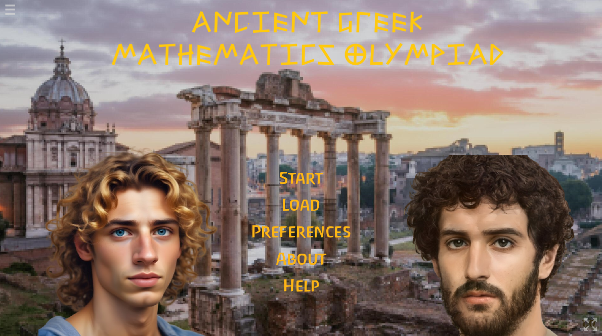
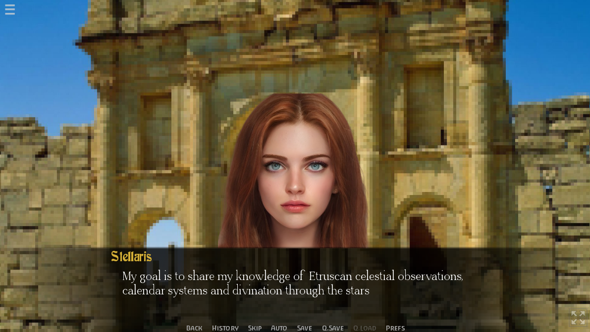
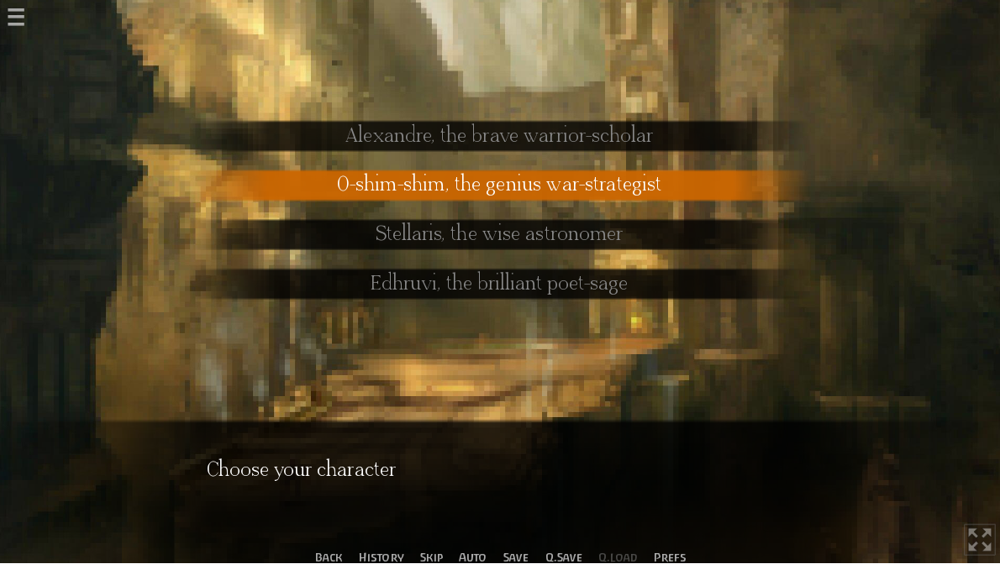
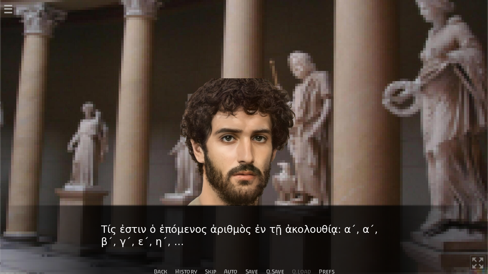
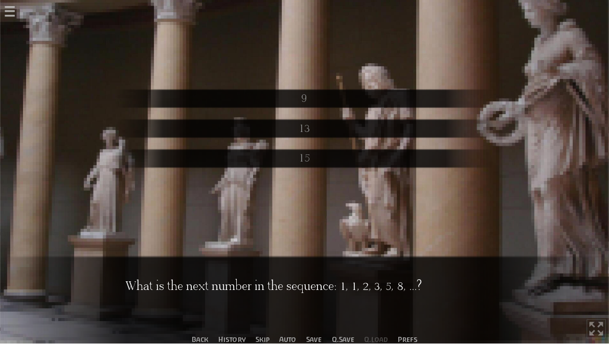
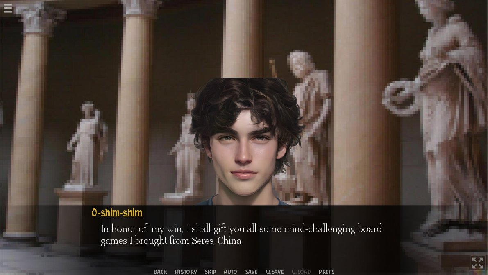
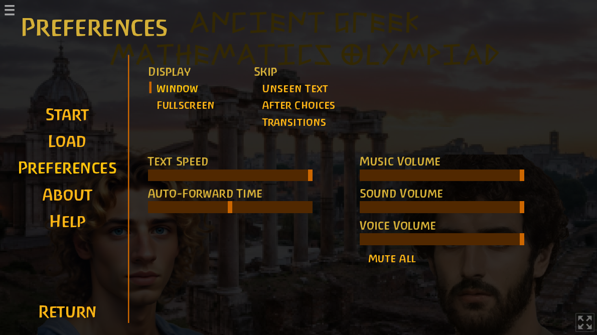
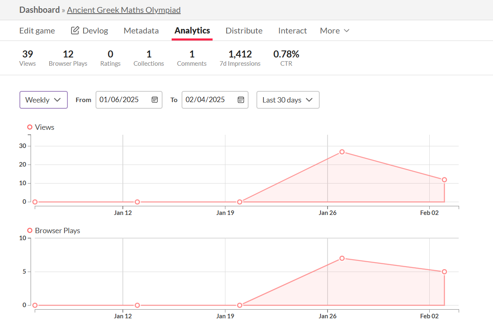

# 🏛️ Ancient Greek Maths Olympiad 

_A historical fiction visual novel with math trivia_  

## 🎮 About the Game  
**Ancient Greek Maths Olympiad** is a **single-player interactive visual novel** where player choices determine the outcome—leading to either a **Good** or **Bad** ending.  

Set in **ancient Greece**, this historical fiction game combines **math trivia** with interactive storytelling  

Built using **Ren'Py** in **Python**  

## 🚀 Play Online  
The game is available online and can be played directly in a browser or downloaded for desktop.  

🔗 **[Play on Itch.io](https://yeeetuuus.itch.io/ancient-greek-maths-olympiad)** 

## 💻 Running the Game Locally  
To play the game on your system:  

1. **Clone the repository:**  
   ```bash
   git clone [https://github.com/tfnov2k/olympiad.git]
   cd Ancient-Greek-Maths-Olympiad
   ```
2. **Install Ren'Py** from [renpy.org](https://www.renpy.org/)  
3. **Run the game** using Ren'Py or execute:  
   ```bash
   renpy Ancient-Greek-Maths-Olympiad
   ```

## 🛠️ Built With  
- **Ren'Py** – A visual novel engine powered by Python  
- **Python** – Core scripting language  
- **Itch.io** – Deployment platform  

## 🎭 Features  
✅ **Interactive Storytelling** – Player choices impact the storyline  
✅ **Multiple Endings** – Experience both Good and Bad endings  
✅ **Math Trivia** – Solve puzzles based on ancient Greek mathematics  
✅ **Cross-Platform** – Play on **desktop and browser**  

## Screenshots
<p align="center">
  
  
  
</p>
<p align="center">
  
  
  
</p>
<p align="center">
  
  
  
</p>

## 🏗️ Contributing  
Want to contribute? Fork the repo, make your changes, and submit a pull request!  

## 📬 Support & Feedback  
For any issues, open a GitHub **issue** or reach out via **Itch.io**.  

---
